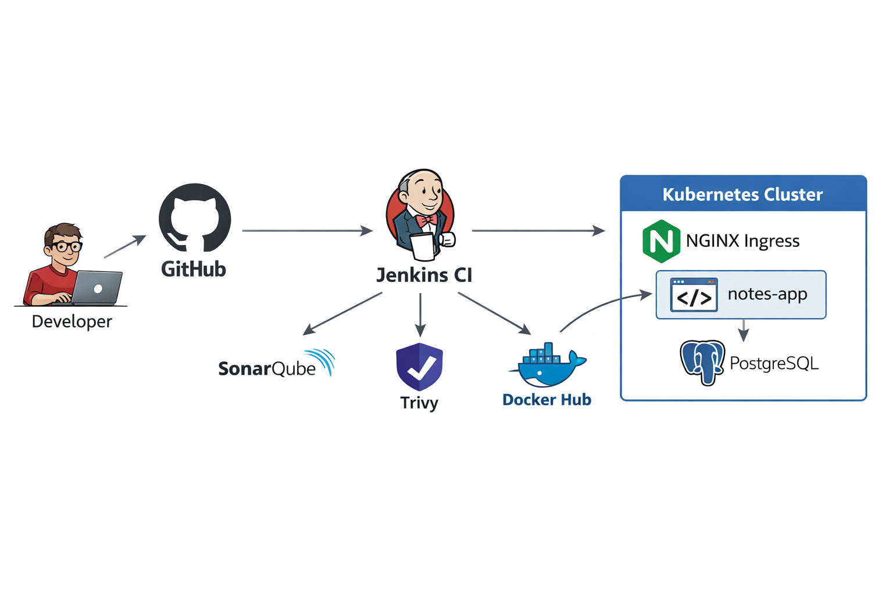

# DevOps Ultimate End-to-End Pipeline 🚀

A **production-grade DevOps project** demonstrating a complete **CI/CD + DevSecOps + Kubernetes** workflow using **open-source tools** on a **real multi-node kubeadm cluster** (bare-metal).

This repository is designed for **real-world DevOps interviews**, not tutorials.

---

## 🌈 Architecture Diagram (High Level)

<p align="center">
  
</p>

<p align="center">
  <b>End-to-End DevOps Pipeline with CI/CD, DevSecOps, Docker, Kubernetes & NGINX Ingress</b>
</p>


---

## 🔥 Key Highlights

* Real backend application (**Python Flask**)
* **PostgreSQL** database
* CI/CD with **Jenkins (Declarative Pipeline)**
* DevSecOps with **SonarQube + Trivy**
* Containerization using **Docker**
* Image registry: **Docker Hub**
* Deployment on **multi-node Kubernetes (kubeadm)**
* Production networking with **NGINX Ingress**
* Real-world debugging (CrashLoopBackOff, startup dependencies)

---

## 🧰 Technology Stack

### CI / DevSecOps

* Jenkins
* SonarQube (code quality)
* Trivy (image vulnerability scanning)

### Containers & Registry

* Docker
* Docker Hub

### Orchestration & Networking

* Kubernetes (kubeadm, multi-node)
* Deployments, Services, Ingress
* InitContainers for dependency handling
* NGINX Ingress Controller (bare-metal)

---

## 🖥️ Infrastructure Setup

| Component | Description              |
| --------- | ------------------------ |
| servera   | Kubernetes control-plane |
| serverb   | Kubernetes worker node   |
| Runtime   | containerd               |
| OS        | Ubuntu 24.04 LTS         |

---

## 📁 Repository Structure

```
DevOps-Ultimate-EndToEnd-Pipeline/
│
├── app/
│   └── backend/              # Flask application
│
├── k8s/
│   ├── app-deployment.yaml
│   ├── app-service.yaml
│   ├── postgres-deployment.yaml
│   ├── postgres-service.yaml
│   └── notes-app-ingress.yaml
│
├── docker-compose.yml        # Local development
├── Jenkinsfile               # CI/CD pipeline
└── README.md
```

---

## 🚀 CI/CD Pipeline Flow

1. Developer pushes code to GitHub
2. Jenkins pipeline triggers automatically
3. SonarQube scans code quality
4. Trivy scans Docker image for CVEs
5. Docker image is built and pushed to Docker Hub
6. Kubernetes pulls and runs the image

---

## ☸️ Kubernetes Deployment Details

* **notes-app**

  * Deployment with 2 replicas
  * Stateless Flask backend
  * Exposed via ClusterIP service

* **PostgreSQL**

  * Single replica
  * Internal ClusterIP service

* **Ingress**

  * NGINX Ingress Controller
  * Host-based routing (`notes-app.local`)
  * Exposed via NodePort on bare-metal

### Dependency Handling

* Used **initContainer** to wait for PostgreSQL
* Prevented CrashLoopBackOff during startup

---

## 🌐 Accessing the Application (Bare-Metal)

```bash
curl -H "Host: notes-app.local" http://<NODE-IP>:<INGRESS_NODEPORT>/health
```

Expected response:

```json
{"status":"UP"}
```

---

## 🧠 Interview-Ready Summary

> "I built an end-to-end DevOps pipeline using Jenkins, SonarQube, Trivy, Docker, and Kubernetes. I deployed a Flask–PostgreSQL application on a multi-node kubeadm cluster, exposed it using NGINX Ingress, and handled real production issues like dependency startup and pod crashes."

---

## 📌 Project Status

✅ **COMPLETED** — Production-ready DevOps portfolio project.

---

## 🙏 Final Note

This project reflects **real DevOps engineering**, not theoretical learning. Every component was built, deployed, and debugged in a real environment.
